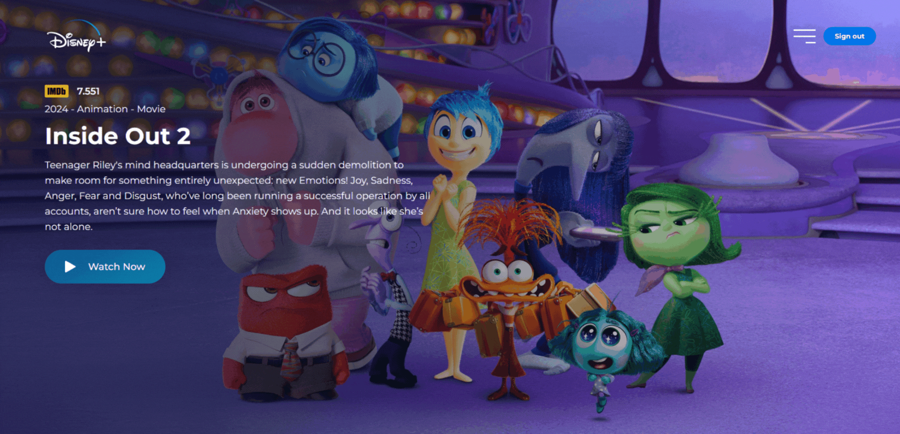

<h1 align="center">
  Disney Plus UI
</h1>



## Objective

The main goal of this project was to recreate the Disney+ interface using modern web technologies, applying **HTML5, CSS3 and JavaScript (ES6+)**. The content is dynamically generated through The Movie Database **(TMDB)** API, which provides detailed film information such as title, synopsis, cover image, background image, and rating, complemented by images enhanced in Photoshop for improved visual quality.

***

## Index

1. [Project Overview](#project-overview)  
2. [Objective](#objective)  
3. [Technologies Used](#technologies-used)  
4. [Installation and Execution](#installation-and-execution)  
5. [Key Concepts Applied](#key-concepts-applied)  
6. [Contact](#contact)  

***

## Project Overview

Disney Plus UI is a professional project that replicates the Disney+ interface using semantic HTML, advanced CSS with global variables and responsive design, JavaScript for dynamic integration with the TMDB API, and images professionally processed in Photoshop at 4K quality.

***

## Technologies Used

- **HTML5**  
- **CSS3**  
- **JavaScript (ES6+)**  
- **TMDB API (The Movie Database)**
- **Photoshop**

***

## Key Features

- Dynamic creation of cards displaying title, description, cover images, background images, and film ratings
- Interactive, responsive, and easy-to-navigate menu
- Visual highlight for the selected active film
- Event handling for dynamic addition and manipulation of films within the interface
- Image loading optimisation to ensure high performance
- Custom favicon for brand recognition
- Custom-designed scroll for improved user experience in the menu
- Smooth fade-in and fade-out transitions on login, password, and password recovery screens for a fluid and professional navigation experience 

***

## Improvements to Implement

- Enable saving films in localStorage to preserve application state across sessions
- Configure the "Watch Now" button to dynamically open film trailers
- Develop search functionality and dynamic film addition within the interface
- Ensure consistent and optimised use of 4K resolution images across all visual elements

***

## Installation and Execution

### 1. Clone the repository  
```bash
git clone https://github.com/NatashaBaudelaire/disneyplusui.git
```

### 2. Requirements  
- Code editor (e.g., Visual Studio Code)  
- Local server extension (e.g., Live Server)  

***

## Key Concepts Applied

- Semantic HTML5 structure
- API consumption using fetch()
- Dynamic DOM creation with createElement()
- Use of global CSS variables defined in :root
- Interactive menus with active item highlighting
- Image loading optimisation
- Custom favicon integration
- Favourite films marking functionality
- Responsive design using media queries
- Smooth fade-in and fade-out transitions
- Basic login/logout system
***

## Contact

For questions, suggestions, or feedback, please open an issue on the repository or contact directly via GitHub.